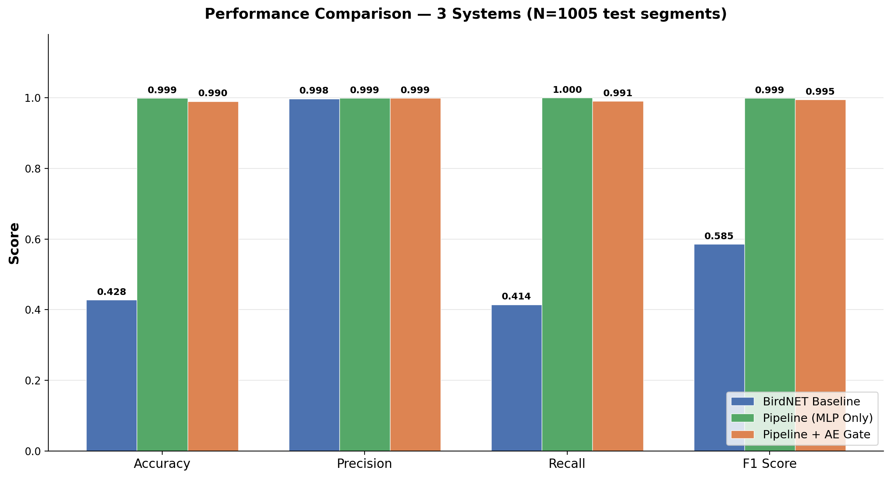
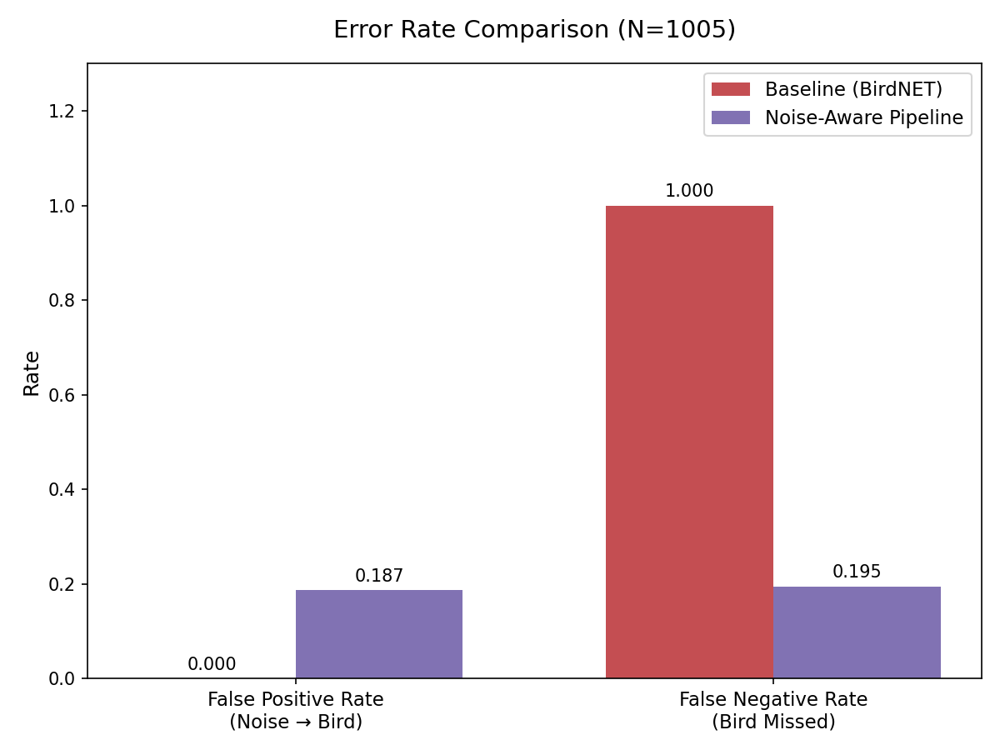

# Noise-Aware Pipeline for Indian Bird Sound Classification

A production-ready, data-centric ML pipeline that segregates clean bird vocalizations from background noise using **BirdNET V2.4** embeddings. Built for the **iBC53** dataset (50 Indian bird species), the system implements automated preprocessing with Noise Segregation V2, 1024-dimensional embedding extraction, binary classification with calibrated thresholds, autoencoder-based anomaly gating, three-class inference routing, and active learning through hard-negative mining.

## Results

Representative metrics on the iBC53 pipeline (segment counts depend on your preprocessing run). **Regenerate numbers** after training:

```bash
python evaluate.py --config config.yaml --full-dataset
python compute_baseline_metrics.py --config config.yaml
```

| Metric | BirdNET Baseline | Noise-Aware Pipeline | Improvement |
|--------|-----------------|---------------------|-------------|
| **Accuracy** | 0.499 | **0.922** | +42.3 pp |
| **Precision** | 0.773 | **0.946** | +17.3 pp |
| **Recall** | 0.529 | **0.958** | +42.9 pp |
| **F1 Score** | 0.628 | **0.952** | +32.4 pp |
| **FPR** (noise misclassified as bird) | 0.619 | **0.218** | 65% reduction |
| **FNR** (bird missed) | 0.471 | **0.042** | 91% reduction |

<p align="center">
  
  
</p>

---

## Pipeline Architecture

```
                            ┌──────────────────────────────────────────────────┐
                            │           Noise-Aware Pipeline                   │
                            │                                                  │
  Raw Audio (iBC53/)        │  ┌────────────┐    ┌──────────────┐             │
  ├── Species_A/  ──────────┼─▶│ Preprocess  │───▶│ Noise Seg V2 │             │
  ├── Species_B/            │  │ 48kHz mono  │    │ (bird/noise  │             │
  └── ...                   │  │ 3s segments │    │  routing)    │             │
                            │  │ RMS silence │    └──────┬───────┘             │
                            │  │ removal     │           │                     │
                            │  └─────────────┘    ┌──────┴───────┘             │
                            │                     │              │             │
                            │              processed/bird  processed/noise     │
                            │                     │              │             │
                            │                     ▼              ▼             │
                            │              ┌─────────────────────────┐         │
                            │              │  BirdNET V2.4 Encoder   │         │
                            │              │  (1024D penultimate)    │         │
                            │              │  TFLite → HDF5 + manifest        │
                            │              └────────────┬────────────┘         │
                            │                           │                     │
                            │                           ▼                     │
                            │              ┌─────────────────────────┐         │
                            │              │   MLP Classifier Head   │         │
                            │              │   1024 → 512 → 256 → 1 │         │
                            │              │   (Binary: bird/noise)  │         │
                            │              └────────────┬────────────┘         │
                            │                           │                     │
                            │              ┌────────────┴────────────┐         │
                            │              │  Autoencoder Gate       │         │
                            │              │  (reconstruction error  │         │
                            │              │   anomaly detection)    │         │
                            │              └────────────┬────────────┘         │
                            │                           │                     │
                            │              ┌────────────┴────────────┐         │
                            │              │  Three-Class Routing    │         │
                            │              │   (see config.yaml)     │         │
                            │         prob > high    between     prob < low     │
                            │              │          │            │           │
                            │              ▼          ▼            ▼           │
                            │        clean_birds/  uncertain/   noise/        │
                            │                         │                       │
                            │                    Manual Review                │
                            │                         │                       │
                            │                   Active Learning               │
                            │                   (Mine → Retrain)              │
                            └──────────────────────────────────────────────────┘
```

### Stages

| Stage | Command | Description |
|-------|---------|-------------|
| **1. Preprocess** | `--stage preprocess` | Resample to 48 kHz mono, 3 s segments, RMS silence drop, Noise Segregation V2 routing |
| **2. Embed** | `--stage embed` | Extract 1024D embeddings from BirdNET V2.4 (TFLite, CPU) into HDF5 + `manifest.csv` |
| **3. Train** | `--stage train` | Train MLP (focal/BCE), F1 checkpointing; optional autoencoder if `autoencoder.train: true` |
| **4. Infer** | `--stage infer` | Three-class routing: `clean_birds/` / `noise/` / `uncertain/` with optional AE gating |
| **5. Evaluate** | `--stage evaluate` | Runs `evaluate.py` on the **held-out test split** (same stratified split as training) |
| **6. Mine** | `--stage mine` | False positive / false negative / uncertain mining for active learning |

For metrics on **every row** of `manifest.csv` (aligned with baseline comparison), run `python evaluate.py --config config.yaml --full-dataset` separately.

---

## Setup

### 1. Environment

```bash
python -m venv .venv
source .venv/bin/activate  # Linux/Mac
# .venv\Scripts\activate   # Windows
```

### 2. Install Dependencies

```bash
pip install -r requirements.txt
```

> `birdnetlib` ships the official BirdNET V2.4 TFLite model (~50 MB). The `ai-edge-litert` package provides the TFLite runtime for Python 3.12+.

### 3. Data Preparation

Place raw audio files organized by species inside `iBC53/` (configurable in `config.yaml`):

```
iBC53/
├── Acridotheres fuscus/
│   ├── 10.wav
│   └── 11.wav
├── Cyornis unicolor/
│   └── 1.wav
├── ...                    # 50 species total
└── noise/                 # recommended for binary training (ambient, synthetic, etc.)
    └── ambient_01.wav
```

Optional: generate extra synthetic noise WAVs into `iBC53/noise/` to reduce white-noise false positives after re-embedding and retraining:

```bash
python generate_synthetic_noise.py --config config.yaml --n_files 50
```

---

## Usage

### Full Pipeline

Runs all stages sequentially (preprocess → embed → train → infer → evaluate → mine):

```bash
python run_pipeline.py --config config.yaml
```

### Individual Stages

```bash
python run_pipeline.py --config config.yaml --stage preprocess
python run_pipeline.py --config config.yaml --stage embed
python run_pipeline.py --config config.yaml --stage train
python run_pipeline.py --config config.yaml --stage infer
python run_pipeline.py --config config.yaml --stage evaluate
python run_pipeline.py --config config.yaml --stage mine
```

### Evaluation (`evaluate.py`)

- **Default / `run_pipeline --stage evaluate`**: metrics on the **test split** (10% by default, stratified, seed from config). Writes `results/metrics.json` (with backup to `metrics_previous_run.json` when present).
- **Full manifest** (same population as baseline comparison):

```bash
python evaluate.py --config config.yaml --full-dataset
```

`results/metrics.json` includes `eval_split`: `"test"` or `"full"`, plus `eval_noise_count` / `eval_bird_count`. Binary routing metrics can treat the uncertain band as bird using `inference.low_threshold` (see below).

### Baseline vs Pipeline Comparison

Uses the **full** `data/embeddings/manifest.csv`: BirdNET confidences from `comparison/baseline_normalized.jsonl` vs. MLP probabilities with **pred bird iff prob > `inference.low_threshold`** (matches routing policy used in evaluation).

```bash
python compute_baseline_metrics.py --config config.yaml
```

Outputs:

- `comparison/baseline_metrics.json`, `comparison/pipeline_metrics.json`, `comparison/comparison_table.json`
- `results/comparison_graphs/metrics_comparison.png`, `results/comparison_graphs/error_comparison.png`

### Strict real BirdNET vs pipeline (slow)

Runs actual BirdNET `Analyzer` inference on processed WAVs and optional `outputs/` routing folders (no JSONL shortcut):

```bash
python evaluate_birdnet_raw_vs_pipeline.py --config config.yaml --threshold 0.5
```

Writes under `results/real_birdnet_eval/` (large JSON possible; may be gitignored).

### Visual Evaluation Plots

```bash
python evaluate_visual.py --config config.yaml
```

Generates `results/confusion_matrix.png`, `results/metrics_bar_chart.png`, and `results/threshold_comparison.png`.

### Streamlit Demo

Interactive upload: segmentation, Noise Segregation V2 tabs, and full embedding → MLP → routing (uses `checkpoints/best_model.pt`).

```bash
streamlit run app.py
# Optional: PIPELINE_CONFIG=/path/to/config.yaml streamlit run app.py
```

### Reset Cached Artifacts

Removes `data/processed/`, `data/embeddings/`, and `checkpoints/` (not raw `iBC53/`):

```bash
python clean_pipeline_outputs.py           # delete
python clean_pipeline_outputs.py --dry-run # preview only
```

---

## Pipeline Modes

Controlled by `pipeline.mode` in `config.yaml`:

| Mode | V2 Scoring | Processed Outputs | Use Case |
|------|------------|-------------------|----------|
| **baseline** | Off | One folder per species; manual `noise/` only | Classic BirdNET + MLP without noise segregation |
| **filtered** | On; drops noise segments | Only V2-bird segments per species | Cleaner species embeddings; fewer segments |
| **full** | On; routes noise to `processed_dir/noise/` | Species folders + `noise/` | Bird vs noise without dropping V2-noise segments (**default**) |

Preprocessing order: **segment (3 s) → RMS silence drop → V2 score (filtered/full) → save WAV + optional `segments_manifest.csv`**.

---

## Three-Class Inference Routing

Thresholds are set in `config.yaml` (`inference.high_threshold`, `inference.low_threshold`). **Current defaults** use a relaxed band to balance false negatives and false positives:

| Condition | Decision | Destination |
|-----------|----------|---------------|
| `prob > high_threshold` | **Bird** | `outputs/clean_birds/` |
| `low_threshold ≤ prob ≤ high_threshold` | **Uncertain** | `outputs/uncertain/` |
| `prob < low_threshold` | **Noise** | `outputs/noise/` |

An optional **autoencoder gate** (reconstruction-error anomaly detector) can reject out-of-distribution segments before classification when `autoencoder.enabled: true`.

**Evaluation note:** `evaluate.py` can report a “routing” metric where **uncertain counts as bird** if `prob > low_threshold` only (binary bird vs noise aligned with deployment policy).

---

## Noise Segregation V2

The V2 noise segregation algorithm classifies each 3-second segment as bird or noise using subframe-level acoustic features:

1. Each segment is split into 0.5 s subframes
2. Per-subframe features: ZCR, spectral flatness, spectral centroid, centroid stability, insect-band autocorrelation
3. Weighted noise score: `S = w_zcr * ZCR + w_flat * Flatness + w_centroid * CentroidFlag + ...`
4. Each subframe votes noise if `S >= threshold`
5. Majority vote across subframes determines the segment label

In `full` mode, segments labeled as noise are saved to `data/processed/noise/` with filenames encoding the original source: `{OriginalSpecies}__{FileNum}_segXXXX.wav`.

---

## Model Architecture

### Embedding Encoder

**BirdNET V2.4** (TFLite on CPU) — the penultimate `GLOBAL_AVG_POOL/Mean` layer produces 1024-dimensional embeddings. XNNPACK delegates are disabled to preserve internal tensor access. Embeddings are stored in per-species HDF5 files with a global `manifest.csv`.

### Binary Classifier

```
Input (1024D)
  → Linear(1024, 512) → BatchNorm → ReLU → Dropout(0.3)
  → Linear(512, 256)  → BatchNorm → ReLU → Dropout(0.3)
  → Linear(256, 1)    → sigmoid → probability
```

**Focal loss** (gamma=2.0) | Adam | Cosine annealing | Early stopping (patience=7) | F1-based checkpointing

### Autoencoder (Optional Anomaly Gate)

Symmetric autoencoder trained on bird-only embeddings when `autoencoder.train: true`. At inference, high reconstruction error can reject OOD inputs when enabled.

---

## Evaluation Details

### Pipeline Evaluation (`evaluate.py`)

Produces `results/metrics.json` including:

- Metrics at threshold 0.5 and F1-optimal threshold (test or full set per `eval_split`)
- Per-class precision, recall, FPR on noise (when both classes exist in the evaluated subset)
- **Routing eval:** uncertain → bird using `inference.low_threshold` / `high_threshold`
- Threshold curve and recall-at-minimum-precision summaries
- Probability distribution statistics per class
- Autoencoder reconstruction error statistics when `autoencoder.enabled: true`
- Optional comparison printout vs. `metrics_previous_run.json` for ΔFPR / ΔFNR on routing metrics

### Baseline Comparison (`compute_baseline_metrics.py`)

- **Ground truth:** `data/embeddings/manifest.csv` (noise = 0, any species folder = 1).
- **Baseline:** max BirdNET detection confidence per segment from `comparison/baseline_normalized.jsonl`, thresholded (default 0.5).
- **Pipeline:** classifier run on **all manifest rows**; binary prediction **pred bird iff sigmoid(logit) > `low_threshold`** (consistent with routing policy).

**Key mapping:** noise rows under `processed/noise/` use filenames `Species__FileNum_seg…` so keys align with BirdNET JSONL paths.

---

## Active Learning Loop

```
1. Train → Infer → Evaluate
2. Review outputs/uncertain/ and outputs/noise/
3. Move verified birds to verified_birds/
4. Run: miner.update_dataset(verified_dir, target_species="<species>")
5. Retrain → repeat
```

The mining stage exports candidates under `outputs/false_positives/`, `outputs/false_negatives/`, and uncertain samples per `mining` config.

---

## Project Structure

```
Noise-Aware-Pipeline-for-Indian-Bird-Sound-Classification/
│
├── config.yaml                          # Central YAML configuration
├── run_pipeline.py                      # CLI entry point (6 stages)
├── evaluate.py                          # Standalone evaluation → results/metrics.json
├── evaluate_visual.py                   # Visual plots → results/*.png
├── compute_baseline_metrics.py          # BirdNET baseline vs pipeline (full manifest)
├── evaluate_birdnet_raw_vs_pipeline.py # Strict real BirdNET Analyzer evaluation
├── generate_synthetic_noise.py          # Optional WAVs into raw noise/ for training
├── app.py                               # Streamlit demo (segmentation + MLP routing)
├── clean_pipeline_outputs.py            # Delete processed/embeddings/checkpoints
├── requirements.txt                     # Python dependencies
│
├── preprocessing/                       # Stage 1: Audio preprocessing
│   ├── preprocessing.py                 #   Core: resample, segment, silence drop, V2 routing
│   ├── noise_segregation_v2.py          #   Subframe noise scoring + majority vote
│   ├── audio_loader.py
│   ├── feature_extractor.py
│   ├── noise_reduction.py
│   └── preprocess_cli.py
│
├── embedding/                           # Stage 2: Embedding extraction
│   ├── embedding.py                     #   BirdNET TFLite encoder, HDF5, manifest
│   ├── embedding_model.py               #   Legacy CNN encoder (unused)
│   └── extract_embeddings.py            #   Legacy .pt extraction (unused)
│
├── dataset/                             # Dataset & DataLoader
│   ├── dataset.py                       #   EmbeddingDataset, splits, class weights
│   ├── bird_dataset.py                  #   Legacy spectrogram dataset (unused)
│   └── data_utils.py                    #   Legacy utilities (unused)
│
├── models/
│   ├── classifier.py                    #   MLP head
│   ├── autoencoder.py
│   └── attention.py                     #   Experimental (unused)
│
├── training/
│   ├── trainer.py
│   ├── autoencoder_trainer.py
│   └── metrics.py                       #   Metrics, routing-as-bird, confusion helpers
│
├── inference/
│   ├── predictor.py                     #   End-to-end inference + routing
│   └── postprocessing.py
│
├── mining/
│   └── mining.py
│
├── birdnet_integration/                 # BirdNET-Analyzer experiment tools
│   ├── run_baseline_birdnet.py
│   ├── run_filtered_birdnet.py
│   ├── normalize_birdnet_export.py
│   ├── align_segments.py
│   ├── compare_baseline_filtered.py
│   ├── run_full_experiment.py
│   ├── integration_config.py
│   └── experiment_config.yaml
│
├── utils/
│   ├── config.py
│   ├── logger.py
│   ├── io_utils.py
│   └── verify_env.py
│
├── tests/
│   └── test_noise_segregation_v2.py
│
├── iBC53/                               # Raw audio (gitignored if large)
├── data/
│   ├── processed/                       #   Preprocessed 3 s WAV segments
│   └── embeddings/                      #   HDF5 + manifest.csv
├── checkpoints/                         #   best_model.pt, autoencoder.pt, meta JSON
├── outputs/                             #   Inference: clean_birds, noise, uncertain, mining exports
├── results/                             #   metrics.json, plots, comparison_graphs/, real_birdnet_eval/
└── comparison/                          #   baseline JSONL, metrics JSON, figures/
    ├── baseline_normalized.jsonl
    ├── baseline_metrics.json
    ├── pipeline_metrics.json
    ├── comparison_table.json
    └── figures/                         #   Extra experiment plots (optional)
```

---

## Configuration Reference

Key settings in `config.yaml`:

```yaml
pipeline:
  mode: full                # baseline | filtered | full

silence_removal:
  rms_threshold_db: -52.0   # quieter segments kept vs. very aggressive -40 dB

embedding:
  model_name: birdnet
  embedding_dim: 1024

model:
  binary: true
  hidden_dims: [512, 256]

training:
  loss: focal
  epochs: 50
  early_stopping:
    patience: 7

inference:
  confidence_threshold: auto  # F1-optimal from training when auto
  high_threshold: 0.6         # prob > this → confident bird
  low_threshold: 0.2          # prob < this → confident noise; routing eval uses this for “uncertain as bird”

autoencoder:
  enabled: true
  train: true                 # train AE in the train stage when true
  recon_threshold: auto

evaluation:
  results_dir: ./results
```

---

## Key Technical Details

- **BirdNET V2.4:** Embeddings from penultimate `GLOBAL_AVG_POOL` (1024D) via TFLite; runs on **CPU** by default (PyTorch training can use **GPU** when `device: cuda`).
- **Noise Segregation V2:** Subframe-level features with majority vote (see `noise_segregation` block in config).
- **Focal Loss:** Handles class imbalance; gamma configurable under `training.focal_loss`.
- **Stratified splits:** Train / val / test from `dataset.val_split` and `dataset.test_split` (default 75% / 15% / 10%, seed=42).
- **Audio I/O:** `soundfile` for WAV; demo supports MP3 via torchaudio where available.

---

## Dataset

**iBC53:** 50 Indian bird species. Segment counts after preprocessing depend on V2 routing and silence settings. Example scale from a completed run:

| Split | Total | Bird | Noise |
|-------|-------|------|-------|
| Full manifest (embeddings) | ~9.8k | ~7.8k | ~2.0k |
| Test (10%) | ~980 | — | — |

Use `wc -l data/embeddings/manifest.csv` and class counts from `compute_baseline_metrics.py` for your exact numbers.

---

## License

This project is for academic and research purposes.
