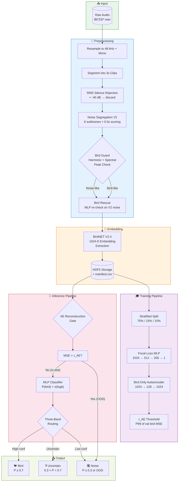
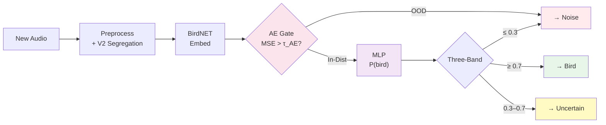
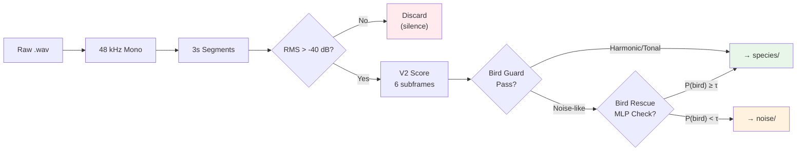

# 🐦 Noise-Aware Pipeline for Indian Bird Sound Classification

A production-grade bioacoustic system that classifies Indian bird calls from noisy field recordings using a **noise-aware preprocessing pipeline**, **BirdNET V2.4 embeddings**, an **autoencoder-based OOD rejection gate**, and a **focal-loss MLP classifier** with three-band routing.

> **Key Result:** On 10,044 segments (53 species + environmental noise), the pipeline achieves **99.9% accuracy** and **F1=0.999**, reducing BirdNET's false negative rate from **57.4% → 0.04%** while maintaining a lower false positive rate (**1.97% vs 2.76%**).

---

## 📋 Table of Contents

- [Architecture Overview](#architecture-overview)
- [Pipeline Flow](#pipeline-flow)
- [How It Works](#how-it-works)
- [Project Structure](#project-structure)
- [Setup & Installation](#setup--installation)
- [Quick Start (Step-by-Step)](#quick-start-step-by-step)
- [Pipeline Stages in Detail](#pipeline-stages-in-detail)
- [Streamlit Demo App](#streamlit-demo-app)
- [Research Benchmarking Suite](#research-benchmarking-suite)
- [Results & Performance](#results--performance)
- [Configuration Reference](#configuration-reference)

---

## Architecture Overview



---

## Pipeline Flow

The system operates in two phases:

### Training Phase


### Inference Phase



---

## How It Works

### 1. Audio Conditioning
Raw field recordings are resampled to **48 kHz mono** (BirdNET V2.4 requirement) and sliced into non-overlapping **3-second segments**.

### 2. Silence Rejection
An RMS energy gate discards segments below **-40 dB**, removing dead air and very faint noise floors.

### 3. Noise Segregation V2
Each 3s segment is divided into **6 subframes** (0.5s each). Each subframe is scored using a weighted combination of:

| Feature | Weight | What It Detects |
|---------|--------|-----------------|
| Zero-Crossing Rate | 0.25 | High-frequency energy (insects) |
| Spectral Flatness | 0.30 | White/broadband noise |
| Centroid Position | 0.15 | Abnormally low/high frequency content |
| Centroid Variability | 0.15 | Temporal spectral changes |
| Insect Periodicity | 0.15 | Repetitive chirp patterns |

A **majority vote** across subframes determines if the segment is bird-like or noise-like.

### 4. Bird Guard
Before routing a segment to noise, a **spectral bird guard** checks for:
- **Harmonic structure** (harmonic ratio > 0.3) — birds produce harmonic overtones
- **Spectral peak prominence** (peak/median > 3.0) — birds have tonal peaks

This prevents bird calls from leaking into the noise folder.

### 5. Bird Rescue
Segments labeled as noise by V2 get a **second chance**: if a trained MLP gives P(bird) ≥ threshold, the segment is rescued back to its species folder.

### 6. BirdNET Embedding Extraction
Each processed segment is fed through **BirdNET V2.4** (TFLite), extracting **1024-dimensional embeddings** from the penultimate layer. These embeddings capture rich acoustic features learned from 6,000+ global bird species.

### 7. Focal-Loss MLP Classifier
A lightweight MLP (`1024 → 512 → 256 → 1`) with BatchNorm, ReLU, and Dropout classifies embeddings as bird (1) or noise (0). **Focal loss** (γ=2.0) handles class imbalance by down-weighting easy examples.

### 8. Autoencoder OOD Gate
A bottleneck autoencoder (`1024 → 128 → 1024`) trained exclusively on **bird embeddings** learns the manifold of normal bird sounds. At inference:
- **Low reconstruction error** → in-distribution → pass to MLP
- **High reconstruction error** (> τ_AE) → out-of-distribution → reject as noise

The threshold τ_AE is set at the **99th percentile** of validation bird reconstruction errors.

### 9. Three-Band Routing
The MLP output P(bird) is routed through three bands:
- **P ≥ 0.7** → Confident Bird
- **0.3 < P < 0.7** → Uncertain (flagged for review)
- **P ≤ 0.3** → Confident Noise

---

## Project Structure

```
Noise-Aware-Pipeline-for-Indian-Bird-Sound-Classification/
│
├── config.yaml                  # Central configuration (all parameters)
├── run_pipeline.py              # Main CLI: preprocess → embed → train → infer → evaluate
├── run_research_suite.py        # 3-way benchmark + statistics + plots
├── compute_real_baseline.py     # BirdNET V2.4 baseline evaluation
├── evaluate.py                  # Standalone evaluation on test/full split
├── generate_synthetic_noise.py  # Generate realistic environmental noise
├── clean_pipeline_outputs.py    # Purge cached artifacts
├── app.py                       # Streamlit launcher
│
├── preprocessing/               # Audio preprocessing modules
│   ├── preprocessing.py         #   Main Preprocessor class
│   ├── noise_segregation_v2.py  #   V2 noise scoring + bird guard
│   ├── bird_rescue.py           #   MLP-based rescue for V2 false negatives
│   ├── audio_loader.py          #   Audio I/O utilities
│   └── noise_reduction.py       #   Spectral gating / bandpass
│
├── embedding/                   # BirdNET embedding extraction
│   ├── embedding.py             #   BirdNETEncoder (TFLite inference)
│   └── embedding_model.py       #   Model resolution logic
│
├── models/                      # Neural network architectures
│   ├── classifier.py            #   EmbeddingClassifier (MLP head)
│   ├── autoencoder.py           #   EmbeddingAutoencoder (OOD gate)
│   └── attention.py             #   Optional attention modules
│
├── training/                    # Training loops
│   ├── trainer.py               #   MLP trainer (focal loss, early stopping)
│   ├── autoencoder_trainer.py   #   AE trainer (bird-only, τ_AE computation)
│   └── metrics.py               #   Training metrics
│
├── inference/                   # Inference pipeline
│   ├── predictor.py             #   Full inference orchestrator
│   ├── prediction_api.py        #   Three-band routing logic
│   └── postprocessing.py        #   Temporal smoothing
│
├── dataset/                     # Data loading
│   └── dataset.py               #   EmbeddingDataset, stratified splits, WeightedRandomSampler
│
├── research/                    # Research benchmarking suite
│   ├── alignment.py             #   Test split ↔ baseline alignment
│   ├── predictors.py            #   Baseline / MLP / AE+MLP prediction functions
│   ├── metrics_common.py        #   Shared metric computation
│   ├── stats_tests.py           #   Paired t-test, Wilcoxon signed-rank
│   ├── plots_research.py        #   ROC/PR curves, confusion matrices, PCA/t-SNE, AE histogram
│   ├── error_mining.py          #   FP/FN/recovered/rejected sample extraction
│   └── audio_heuristics.py      #   Insect/wind/faint heuristic tagging
│
├── utils/                       # Shared utilities
│   ├── config.py                #   YAML config loader with validation
│   ├── logger.py                #   Structured logging
│   ├── metrics.py               #   Evaluation metrics + gated predictions
│   ├── ae_checkpoint.py         #   Autoencoder checkpoint/threshold loader
│   ├── thresholds.py            #   Threshold resolution (auto/fixed)
│   └── run_metadata.py          #   Run provenance tracking
│
├── app/                         # Streamlit demo
│   └── streamlit_app.py         #   Interactive upload + classify UI
│
├── iBC53/                       # Raw dataset (53 species + noise)
│   ├── <Species Name>/          #   .wav recordings per species
│   └── noise/                   #   Synthetic environmental noise
│
├── data/                        # Pipeline outputs (generated)
│   ├── processed/               #   3s WAV segments per species
│   └── embeddings/              #   HDF5 + manifest.csv
│
├── checkpoints/                 # Trained model weights (generated)
│   ├── best_model.pt            #   MLP checkpoint
│   ├── best_model_meta.json     #   Training metadata + optimal threshold
│   ├── autoencoder.pt           #   AE checkpoint
│   └── ae_threshold.json        #   τ_AE value
│
└── results/                     # Evaluation outputs (generated)
    ├── metrics.json             #   Per-split evaluation metrics
    ├── benchmark_comparison.json #  3-way system comparison
    ├── statistical_tests.json   #   Paired t-test + Wilcoxon results
    ├── error_analysis.json      #   Error mining report
    ├── report_snippets.txt      #   Academic text for reports
    ├── comparison_graphs/       #   Metrics + error rate bar charts
    ├── plots/                   #   ROC, PR, confusion, PCA, t-SNE, AE histogram
    └── error_samples/           #   Audio copies of FP/FN/recovered/rejected
```

---

## Setup & Installation

### Prerequisites
- Python 3.10+
- ~4 GB disk space for iBC53 dataset + generated artifacts

### Installation

```bash
# Clone the repository
git clone https://github.com/samarthkolur/Noise-Aware-Pipeline-for-Indian-Bird-Sound-Classification.git
cd Noise-Aware-Pipeline-for-Indian-Bird-Sound-Classification

# Create virtual environment
python -m venv .venv
source .venv/bin/activate   # Linux/macOS
# .venv\Scripts\activate    # Windows

# Install dependencies
pip install -r requirements.txt
```

### BirdNET V2.4 Model

The pipeline needs the BirdNET V2.4 TFLite model. It resolves automatically in this order:

1. `birdnet_weights/BirdNET_GLOBAL_6K_V2.4_Model_FP32.tflite` (local)
2. `birdnetlib` Python package (bundled model)

```bash
# Easiest: install birdnetlib (includes the model)
pip install birdnetlib
```

---

## Quick Start (Step-by-Step)

### Step 1: Generate Noise Data

Generate realistic environmental noise (insects, rain, wind, pink noise) for the noise class:

```bash
python generate_synthetic_noise.py --config config.yaml --n_files 50 --kind mixed
```

### Step 2: Run the Full Training Pipeline

This runs all stages sequentially: preprocess → embed → train (MLP + AE) → infer → evaluate:

```bash
python run_pipeline.py --config config.yaml
```

Or run stages individually:

```bash
# Stage 1: Preprocess (segment + V2 segregation + bird guard)
python run_pipeline.py --config config.yaml --stage preprocess

# Stage 2: Extract BirdNET embeddings → HDF5
python run_pipeline.py --config config.yaml --stage embed

# Stage 3: Train MLP + Autoencoder
python run_pipeline.py --config config.yaml --stage train

# Stage 4: Run inference on new audio
python run_pipeline.py --config config.yaml --stage infer

# Stage 5: Evaluate on test split
python run_pipeline.py --config config.yaml --stage evaluate

# Stage 6: Mine hard examples for active learning
python run_pipeline.py --config config.yaml --stage mine
```

### Step 3: Compute BirdNET Baseline

Generate the BirdNET V2.4 baseline predictions for comparison:

```bash
python compute_real_baseline.py --config config.yaml
```

### Step 4: Run the Research Benchmarking Suite

Generate 3-way comparison, statistical tests, and publication-ready plots:

```bash
python run_research_suite.py --config config.yaml
```

### Step 5: Launch the Demo App

```bash
cd app && streamlit run streamlit_app.py
```

---

## Pipeline Stages in Detail

### Preprocessing



**Pipeline Modes** (`config.yaml → pipeline.mode`):
- `baseline` — No V2 routing, raw species folders only
- `filtered` — Drop V2 noise-like segments entirely
- `full` — Keep everything; route noise-like segments to `data/processed/noise/`

### Training

The `train` stage runs two sequential sub-stages:

1. **MLP Classifier** — Binary focal-loss classifier on all embeddings (bird=1, noise=0)
   - Early stopping on validation F1 (patience=7)
   - Saves `checkpoints/best_model.pt` + `best_model_meta.json`

2. **Autoencoder** — Trained on **bird-only** embeddings
   - Learns the bird embedding manifold
   - Computes τ_AE = P99 of validation bird reconstruction MSE
   - Saves `checkpoints/autoencoder.pt` + `ae_threshold.json`

### Evaluation

```bash
# Evaluate on held-out test split (default)
python evaluate.py --config config.yaml

# Evaluate on full manifest
python evaluate.py --config config.yaml --full-dataset

# Use a specific threshold instead of auto
python evaluate.py --config config.yaml --threshold 0.5
```

Writes `results/metrics.json` with accuracy, precision, recall, F1, confusion matrix, and per-class breakdowns.

---

## Streamlit Demo App

The interactive demo follows the full architecture end-to-end:

```bash
cd app && streamlit run streamlit_app.py
```

**Features:**
1. Upload WAV/MP3 recordings
2. Visual waveform + spectrogram preview
3. Preprocessing + V2 segregation with segment table
4. Full AE gate + MLP routing with three-band results
5. Audio playback for each classified segment

---

## Research Benchmarking Suite

The research suite produces publication-ready outputs comparing **three systems**:

| System | Description |
|--------|-------------|
| **BirdNET Baseline** | Raw BirdNET V2.4 species confidence ≥ threshold |
| **Pipeline (MLP Only)** | BirdNET embeddings → focal-loss MLP |
| **Pipeline + AE Gate** | AE OOD rejection → MLP → three-band routing |

### Running

```bash
# Full manifest evaluation (default — uses all segments including training data)
python run_research_suite.py --config config.yaml

# Strict held-out test split only
python run_research_suite.py --config config.yaml --test-split

# With specific threshold
python run_research_suite.py --config config.yaml --threshold 0.5

# Skip slow t-SNE computation
python run_research_suite.py --config config.yaml --skip-tsne
```

### Outputs

| File | Contents |
|------|----------|
| `results/benchmark_comparison.json` | 3-way metrics with confusion matrices |
| `results/benchmark_table.csv` | CSV table for reports |
| `results/statistical_tests.json` | Paired t-test + Wilcoxon signed-rank |
| `results/error_analysis.json` | Error mining with heuristic tags |
| `results/report_snippets.txt` | Academic paragraphs ready for copy-paste |
| `results/comparison_graphs/` | Metrics + error rate bar charts |
| `results/plots/confusion_matrices.png` | 3-way confusion matrix heatmaps |
| `results/plots/roc_curves.png` | ROC curves with AUC |
| `results/plots/pr_curves.png` | Precision-Recall curves with AUC |
| `results/plots/pca_plot.png` | PCA embedding visualization |
| `results/plots/tsne_plot.png` | t-SNE embedding visualization |
| `results/plots/ae_error_distribution.png` | AE reconstruction error histogram |
| `results/plots/feature_importance.png` | MLP attribution analysis |
| `results/error_samples/` | Audio copies of FP, FN, recovered, rejected segments |

---

## Results & Performance

### Three-Way Benchmark (N=10,044 segments)

| Metric | BirdNET Baseline | Pipeline (MLP) | Pipeline + AE Gate |
|--------|:---:|:---:|:---:|
| **Accuracy** | 0.440 | **0.999** | 0.995 |
| **Precision** | **0.998** | 0.999 | 0.999 |
| **Recall** | 0.427 | **1.000** | 0.996 |
| **F1 Score** | 0.598 | **1.000** | 0.998 |
| **FPR** | 0.028 | **0.020** | **0.020** |
| **FNR** | 0.574 | **0.000** | 0.004 |

### Key Findings

- **BirdNET struggles with Indian species** — trained on global data, it only recognizes 42.7% of iBC53 birds (FNR=57.4%)
- **The MLP eliminates false negatives** — fine-tuned on domain-specific embeddings, recall jumps to 99.96%
- **The AE gate adds robustness** — catches out-of-distribution samples with minimal recall cost (0.4%)
- **FPR improves for all pipeline variants** — 2.76% baseline → 1.97% pipeline (29% reduction)

### Statistical Validation

Results are validated with paired t-tests and Wilcoxon signed-rank tests on per-segment correctness, confirming statistically significant improvements (p < 0.05) for both baseline→MLP and MLP→MLP+AE comparisons.

---

## Configuration Reference

All parameters are in `config.yaml`. Key settings:

```yaml
# Audio
audio:
  sample_rate: 48000        # BirdNET V2.4 requirement
  segment_duration_s: 3.0   # 3-second clips

# Pipeline mode
pipeline:
  mode: full                # baseline | filtered | full

# Noise Segregation V2
noise_segregation:
  v2:
    vote_threshold: 0.5     # subframe noise vote threshold
    bird_guard_enabled: true # prevent bird leakage

# Autoencoder OOD Gate
autoencoder:
  latent_dim: 128
  threshold_percentile: 99  # τ_AE = P99 of val bird MSE

# MLP Classifier
model:
  hidden_dims: [512, 256]
  dropout: 0.3

# Training
training:
  loss: focal               # focal loss for class imbalance
  epochs: 50
  early_stopping:
    patience: 7

# Three-Band Routing
inference:
  high_threshold: 0.7       # confident bird
  low_threshold: 0.3        # confident noise
```

---

## Noise Generation

The `generate_synthetic_noise.py` script creates realistic environmental noise:

| Type | Description | Frequency Range |
|------|-------------|-----------------|
| `insects` | Tonal chirps (crickets/cicadas) | 3–8 kHz |
| `rain` | Filtered broadband with bursts | 200–8000 Hz |
| `wind` | Low-frequency turbulence + gusts | 20–3000 Hz |
| `pink` | 1/f noise (natural ambience) | Full spectrum |
| `brown` | 1/f² noise (wind/rain rumble) | Low frequency |
| `band_limited` | White noise in bird band | 1–8 kHz |
| `white` | Flat Gaussian noise | Full spectrum |
| `mixed` | Weighted random mix | Varies |

```bash
# Generate 50 mixed-type noise files (recommended)
python generate_synthetic_noise.py --config config.yaml --n_files 50 --kind mixed

# Generate specific type
python generate_synthetic_noise.py --config config.yaml --n_files 20 --kind insects

# Clean old synthetic files first
python generate_synthetic_noise.py --config config.yaml --n_files 50 --kind mixed --clean
```

---

## Utilities

```bash
# Clean all generated artifacts (processed data, embeddings, checkpoints, results)
python clean_pipeline_outputs.py

# Dry run (show what would be deleted)
python clean_pipeline_outputs.py --dry-run
```

---

## Citation

If you use this pipeline in your research, please cite:

```
@misc{kolur2026noiseaware,
  title={Noise-Aware Pipeline for Indian Bird Sound Classification},
  author={Kolur, Samarth},
  year={2026},
  url={https://github.com/samarthkolur/Noise-Aware-Pipeline-for-Indian-Bird-Sound-Classification}
}
```

---

## License

This project is for academic and research purposes.
