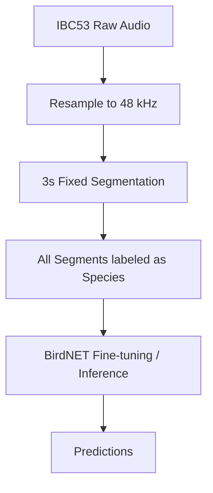
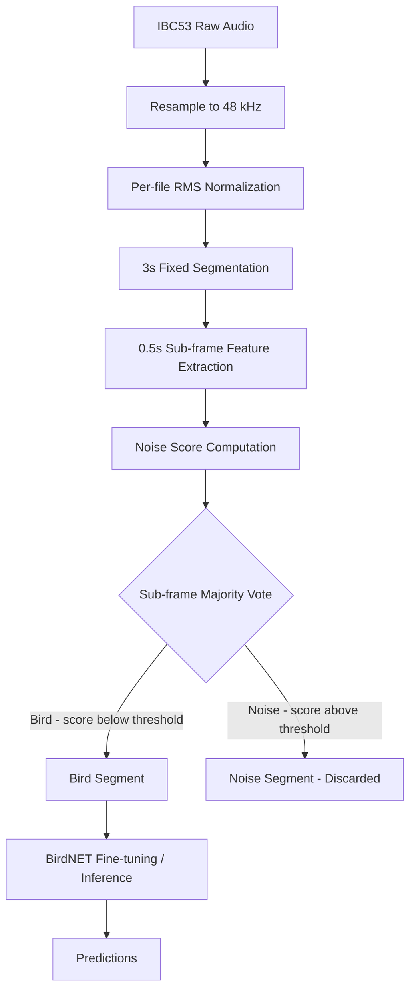

# Noise-Aware Preprocessing Pipeline for Indian Bird Sound Classification

---

## Project Aim

This project evaluates whether **rule-based acoustic noise segregation improves
BirdNET inference and fine-tuning performance** on a regional Indian bird
audio dataset (IBC53).

The central hypothesis is that blind fixed-window segmentation of field
recordings introduces a significant proportion of noise-contaminated training
examples, which degrade model accuracy and inflate false positive rates. A
lightweight, configurable signal-processing pipeline (Noise Segregation V2) is
proposed and evaluated against a no-filtering baseline to quantify this effect.

---

## Problem Statement

BirdNET is a pre-trained deep learning model for bird species identification
trained on large curated datasets from temperate regions. When fine-tuned on
Indian field recordings from IBC53, the standard preprocessing approach applies
uniform 3-second segmentation to raw audio without content analysis. This
produces training segments that contain:

- Extended silence between vocalizations
- Wind and low-frequency ambient noise
- Insect stridulation overlapping bird calls
- Mixed acoustic events with no dominant bird vocalization

These segments are assigned species labels based on their source file alone,
regardless of acoustic content. The result is a contaminated training set that
teaches the model to associate noise patterns with bird species labels, reducing
classification confidence and increasing false positives on non-bird audio.

---

## Dataset

**IBC53 — Indian Bird Call Dataset**

| Property | Value |
|----------|-------|
| Source | Kaggle: `arghyasahoo/ibc53-indian-bird-call-dataset` |
| Species | 53 Indian bird species |
| Total recordings | 1,368 WAV files |
| Environment | Field recordings, varying gain levels, background noise |
| Format | Variable sample rate; resampled to 48 kHz in pipeline |

---

## Experimental Comparison: With vs Without Noise Filtering

The core experiment compares two end-to-end pipelines on the same IBC53 dataset:

### Pipeline A — Baseline (No Filtering)

Raw audio is resampled and segmented uniformly. All segments are passed directly
to BirdNET for fine-tuning or inference without any content validation.



### Pipeline B — Noise Segregation V2

Audio is normalized per file, segmented into 3-second windows, and each segment
is evaluated using sub-frame signal processing. Segments classified as noise are
excluded from training data.



### Evaluation Metrics

| Metric | Purpose |
|--------|---------|
| Top-1 Accuracy | Overall species classification correctness |
| Macro F1 | Per-species performance averaged equally across all 53 species |
| Weighted F1 | Per-species performance weighted by class frequency |
| Per-species Recall | Identifies which species benefit most from filtering |
| False Positive Rate | Rate of incorrect species predictions on pure-noise audio |
| Accuracy vs SNR | Classification accuracy at 0, 5, 10 dB signal-to-noise ratio |

A statistically significant improvement in accuracy or reduction in false
positive rate for Pipeline B over Pipeline A would validate the hypothesis that
noise segregation improves BirdNET adaptation to Indian field recordings.

---

## Noise Segregation V2 Design

Each 3-second segment is divided into six 0.5-second sub-frames. Features are
computed per sub-frame and combined into a noise score. Silent sub-frames are
excluded from voting.

### Feature Set

| Feature | Computation | Noise Indicator |
|---------|-------------|-----------------|
| RMS Energy (dB) | `20 * log10(rms + eps)` | Below -42 dB → silent, excluded from vote |
| Zero-Crossing Rate | Mean sign changes per sample | High ZCR → broadband/wind noise |
| Spectral Flatness | Geometric mean / arithmetic mean of spectrum | Near 1.0 → white noise; near 0.0 → tonal bird call |
| Spectral Centroid Mean | Frequency-weighted mean of spectrum | Outside [1000, 10000] Hz → flagged as noise |
| Spectral Centroid Std | Variance of centroid across short frames | High variance → wind instability |
| Autocorrelation Peak | Normalized peak in lag window 5-20 ms | High peak → periodic insect stridulation |

### Noise Score Formula

```
S = 0.25 * norm(ZCR,          0.30)
  + 0.30 * norm(Flatness,      1.00)
  + 0.15 * centroid_flag
  + 0.15 * norm(CentroidStd,  2500.0)
  + 0.15 * insect_flag

norm(x, ceiling) = clip(x / ceiling, 0, 1)
centroid_flag    = 1 if centroid < 1000 Hz or centroid > 10000 Hz else 0
insect_flag      = 1 if autocorr_peak > 0.70 else 0
```

Weights sum to 1.0. A sub-frame with S >= 0.50 votes noise. A segment is
labeled noise if fewer than 50% of active sub-frames vote bird.

### Tunable Constants

```python
SILENCE_GATE_DB      = -42.0   # Sub-frame energy cutoff
CENTROID_LOW_HZ      = 1000.0  # Lower bound of bird centroid range
CENTROID_HIGH_HZ     = 10000.0 # Upper bound of bird centroid range
AUTOCORR_THRESH      = 0.70    # Insect stridulation detection threshold
AUTOCORR_LAG_MIN_MS  = 5.0     # Lag window start (ms)
AUTOCORR_LAG_MAX_MS  = 20.0    # Lag window end (ms)
ZCR_MAX              = 0.30    # ZCR normalization ceiling
CSTD_MAX             = 2500.0  # Centroid std normalization ceiling
NOISE_SCORE_THRESH   = 0.50    # Sub-frame noise classification threshold
VOTE_THRESHOLD       = 0.50    # Segment-level bird vote fraction
```

All constants were calibrated against feature distributions extracted from a
sample of 2,952 sub-frames across 50 IBC53 recordings. Threshold values were
chosen to reflect the observed data range rather than set arbitrarily.

---

## Segmentation Results

| Metric | Value |
|--------|-------|
| Total source files | 1,368 |
| Total segments produced | 14,535 |
| Bird segments | 13,256 (91.2%) |
| Noise segments | 1,279 (8.8%) |
| Per-species report | `data/segmentation_report.csv` |

---

## Repository Structure

```
.
+-- segmentation/
|   +-- segment_audio.py          # Core pipeline: resample, normalize, segment, classify
+-- download_ibc53.py              # Dataset download, integrity validation, auto-extract
+-- calibrate_features.py          # Pre-segmentation feature distribution analysis
+-- analyze_segmented_output.py    # Post-segmentation bird vs noise feature comparison
+-- create_train_val_split.py      # 80/20 train/validation split
+-- baseline_test.py               # BirdNET inference smoke test
+-- requirements.txt
+-- .gitignore
+-- README.md
```

---

## Setup Instructions

```bash
# 1. Clone repository
git clone <repo-url>
cd Noise-Aware-Pipeline-for-Indian-Bird-Sound-Classification

# 2. Create virtual environment
python -m venv venv
venv\Scripts\activate        # Windows
# source venv/bin/activate   # Linux/macOS

# 3. Install dependencies
pip install -r requirements.txt

# 4. Place Kaggle credentials at ~/.kaggle/kaggle.json
#    (Download from kaggle.com/account -> Create New API Token)

# 5. Download IBC53 dataset
python download_ibc53.py

# 6. Calibrate thresholds (optional review step)
python segmentation/segment_audio.py --calibrate 500

# 7. Run full segmentation with Noise Segregation V2
python segmentation/segment_audio.py

# 8. Create train/validation split
python create_train_val_split.py

# 9. Analyze post-segmentation feature distributions
python analyze_segmented_output.py --max_segments_per_class 500
```

---

## Future Work

1. **BirdNET fine-tuning experiments:** Execute Pipeline A and Pipeline B
   fine-tuning with identical hyperparameters and compare Top-1 Accuracy,
   Macro F1, and False Positive Rate on held-out audio.

2. **Explicit noise class (Pipeline C):** Include a third experiment in which
   rejected noise segments are added to training as a dedicated noise class,
   allowing the model to explicitly abstain on non-bird inputs.

3. **Ground-truth evaluation of noise segregation:** Manually annotate a
   stratified sample of 400 segments and compute Noise Detection Precision,
   Recall, and F1 for V2. Apply McNemar's test to confirm statistical
   significance over the no-filtering baseline.

4. **Threshold optimization:** Perform grid search over `NOISE_SCORE_THRESH`
   and `VOTE_THRESHOLD` against the annotated ground truth subset to identify
   the operating point that maximizes bird preservation while maintaining noise
   rejection.

5. **CNN binary classifier:** Replace the rule-based scoring stage with a
   lightweight binary convolutional classifier (bird vs noise) trained on
   V2-labeled segments as a supervised alternative. Evaluate whether the
   learned classifier improves segregation precision on the annotated subset.