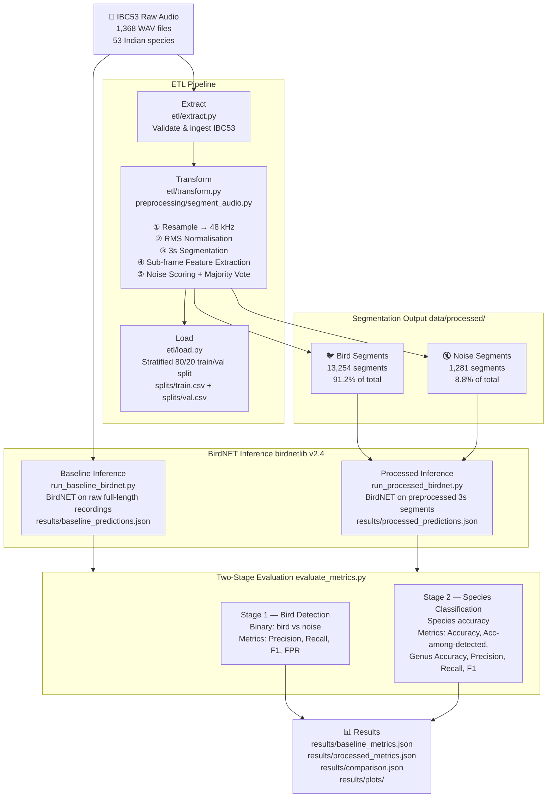

# Noise-Aware ETL Pipeline for Indian Bird Sound Classification

---

## Project Overview

This project evaluates whether **rule-based acoustic noise preprocessing improves
BirdNET inference performance** on the IBC53 Indian bird audio dataset.

The central question is: *does filtering out noisy audio segments before BirdNET
inference improve classification quality?*

A lightweight signal-processing ETL pipeline (Noise Segregation V2) is built and
evaluated against a no-filtering baseline. The evaluation uses a **two-stage
framework** — Stage 1 measures bird detection quality, Stage 2 measures species
classification quality — to cleanly separate what preprocessing improves from
what it does not.

---

## Pipeline Architecture


```mermaid
flowchart TD
    A["🎵 IBC53 Raw Audio\n1,368 WAV files\n53 Indian species"]

    subgraph ETL ["ETL Pipeline"]
        B["Extract\netl/extract.py\nValidate & ingest IBC53"]
        C["Transform\netl/transform.py\npreprocessing/segment_audio.py\n\n① Resample → 48 kHz\n② RMS Normalisation\n③ 3s Segmentation\n④ Sub-frame Feature Extraction\n⑤ Noise Scoring + Majority Vote"]
        D["Load\netl/load.py\nStratified 80/20 train/val split\nsplits/train.csv + splits/val.csv"]
    end

    subgraph SEG ["Segmentation Output  data/processed/"]
        E["🐦 Bird Segments\n13,254 segments\n91.2% of total"]
        F["🔇 Noise Segments\n1,281 segments\n8.8% of total"]
    end

    subgraph INF ["BirdNET Inference  birdnetlib v2.4"]
        G["Baseline Inference\nrun_baseline_birdnet.py\nBirdNET on raw full-length recordings\nresults/baseline_predictions.json"]
        H["Processed Inference\nrun_processed_birdnet.py\nBirdNET on preprocessed 3s segments\nresults/processed_predictions.json"]
    end

    subgraph EVAL ["Two-Stage Evaluation  evaluate_metrics.py"]
        I["Stage 1 — Bird Detection\nBinary: bird vs noise\nMetrics: Precision, Recall, F1, FPR"]
        J["Stage 2 — Species Classification\nSpecies accuracy\nMetrics: Accuracy, Acc-among-detected,\nGenus Accuracy, Precision, Recall, F1"]
    end

    K["📊 Results\nresults/baseline_metrics.json\nresults/processed_metrics.json\nresults/comparison.json\nresults/plots/"]

    A --> B
    B --> C
    C --> D
    C --> E
    C --> F
    A --> G
    E --> H
    F --> H
    G --> EVAL
    H --> EVAL
    I --> K
    J --> K
```

---

## Noise Segregation V2 — How It Works

Each raw recording goes through five steps inside `etl/transform.py` and
`preprocessing/segment_audio.py`:

```
Raw WAV
  │
  ▼  ① Resample to 48 kHz (librosa)
  │
  ▼  ② Per-file RMS Normalisation
  │     Scale so 95th-percentile RMS = 0.05 reference level
  │
  ▼  ③ Non-overlapping 3-second Segmentation
  │     144,000 samples per segment; trailing audio < 3s discarded
  │
  ▼  ④ Sub-frame Feature Extraction (6 × 0.5s per segment)
  │     Features per sub-frame:
  │       • RMS Energy (dB)         — silence gate at -42 dB
  │       • Zero-Crossing Rate      — high ZCR = broadband noise
  │       • Spectral Flatness       — near 1.0 = white noise
  │       • Spectral Centroid Mean  — outside [1000, 10000] Hz = noise flag
  │       • Spectral Centroid Std   — high variance = wind instability
  │       • Autocorrelation Peak    — periodic peak = insect stridulation
  │
  ▼  ⑤ Noise Scoring + Majority Vote
       Noise score S = 0.25·ZCR + 0.30·Flatness + 0.15·centroid_flag
                     + 0.15·CentroidStd + 0.15·insect_flag
       S ≥ 0.50 → sub-frame votes noise
       bird_votes / active_frames ≥ 0.50 → segment = bird
       else → segment = noise
         │
         ├── Bird → data/processed/<species>/
         └── Noise → data/processed/noise/
```

---

## Two-Stage Evaluation Design

### Why two stages?

Single overall accuracy conflates two separate failure modes:

| Failure mode | Caused by | Affected by preprocessing? |
|---|---|---|
| BirdNET returns no detection | Faint call, unfamiliar species | No — coverage is independent |
| BirdNET detects but classifies wrong | Ambiguous audio, noise | Yes — preprocessing removes noise before inference |

Separating these gives a clearer picture of where preprocessing actually helps.

### Stage 1 — Bird Detection (binary)

Uses BirdNET output as a binary detector on preprocessed segments:
- **Positive (bird):** `top_prediction is not None`
- **Negative (noise):** `top_prediction is None`
- Ground truth: `is_noise` label from the segmentation step

### Stage 2 — Species Classification

Evaluates species-level accuracy, split two ways:
- **Overall accuracy:** correct / all segments (penalises no-detections)
- **Accuracy among detected:** correct / segments where BirdNET fired (isolates classification quality)

---

## Experimental Results

### Segmentation Summary

| Metric | Value |
|--------|-------|
| Source recordings | 1,368 |
| Total segments produced | 14,535 |
| Bird segments | 13,254 (91.2%) |
| Noise segments | 1,281 (8.8%) |

### Stage 1 — Bird Detection (Processed Pipeline)

| Metric | Value | Interpretation |
|--------|-------|----------------|
| Detection Precision | **0.9365** | 93.6% of BirdNET detections on preprocessed segments are genuine bird audio |
| Detection Recall | **0.3256** | BirdNET fires on 32.6% of bird segments — conservative coverage |
| Detection F1 | **0.4832** | Reflects the precision/recall tradeoff |
| Detection Rate | **0.3256** | 32.6% of bird segments yield a BirdNET detection |
| FPR (noise → bird) | **0.1514** | 15.1% of noise segments still trigger a false BirdNET detection |

### Stage 2 — Species Classification

| Metric | Baseline (raw) | Processed (filtered) | Delta |
|--------|---------------|---------------------|-------|
| Accuracy (all files) | 0.2270 | 0.1850 | −0.042 |
| **Accuracy among detected** | **0.4038** | **0.5681** | **+0.164** ✅ |
| Genus accuracy | 0.3297 | 0.2314 | −0.098 |
| Precision (macro) | 0.1465 | 0.1707 | +0.024 |
| Recall (macro) | 0.0964 | 0.0744 | −0.022 |
| F1 (macro) | 0.1089 | 0.0912 | −0.018 |

### Key Finding

> **Preprocessing improves species classification accuracy among detected segments
> from 40.4% to 56.8% — a +16.4% gain.**
>
> The noise filter trades coverage (lower detection recall) for quality (higher
> classification accuracy when a detection is made). Among segments that BirdNET
> does detect, 93.6% are genuine bird audio — demonstrating high filter precision.

### Why Overall Accuracy Drops

Overall accuracy falls because the processed pipeline feeds BirdNET individual
3-second segments, while the baseline feeds full recordings. BirdNET aggregates
evidence across many internal windows on a full recording; a single 3-second
segment gives it only one window. This increases the no-detection rate from 44.6%
(baseline) to 67.7% (processed), which is an inference granularity effect, not
evidence that preprocessing degrades audio quality.

---

## Dataset

**IBC53 — Indian Bird Call Dataset**

| Property | Value |
|----------|-------|
| Source | Kaggle: `arghyasahoo/ibc53-indian-bird-call-dataset` |
| Species | 53 Indian bird species |
| Total recordings | 1,368 WAV files |
| Environment | Field recordings, varying gain, background noise |
| Format | Variable sample rate; resampled to 48 kHz in pipeline |

---

## Repository Structure

```
.
├── run_pipeline.py                      # Master orchestrator (runs all 6 steps)
├── run_baseline_birdnet.py              # BirdNET inference on raw IBC53 recordings
├── run_processed_birdnet.py             # BirdNET inference on preprocessed segments
├── evaluate_metrics.py                  # Two-stage evaluation + plots
├── download_ibc53.py                    # Kaggle dataset downloader
│
├── etl/
│   ├── extract.py                       # ETL Step 1 — validate & ingest IBC53
│   ├── transform.py                     # ETL Step 2 — segment + noise filter
│   └── load.py                          # ETL Step 3 — stratified train/val split
│
├── preprocessing/
│   ├── segment_audio.py                 # Core: resample, normalise, segment, classify
│   ├── calibrate_features.py            # Pre-segmentation feature distribution analysis
│   └── analyze_segmented_output.py      # Post-segmentation bird vs noise comparison
│
├── data/
│   ├── IBC53/                           # Raw dataset (53 species, 1,368 WAVs)
│   ├── processed/                       # Preprocessed segments (generated)
│   │   ├── <species>/                   # Bird segments per species
│   │   └── noise/                       # Rejected noise segments
│   └── transform_report.csv             # Per-species segment counts (generated)
│
├── results/
│   ├── baseline_predictions.json        # BirdNET predictions on raw audio
│   ├── processed_predictions.json       # BirdNET predictions on preprocessed audio
│   ├── baseline_metrics.json            # Stage 1 + 2 metrics for baseline
│   ├── processed_metrics.json           # Stage 1 + 2 metrics for processed
│   ├── comparison.json                  # Delta table across all metrics
│   └── plots/
│       ├── confusion_matrix_baseline.png
│       ├── confusion_matrix_processed.png
│       ├── metrics_bar_chart.png        # Stage 2 baseline vs processed comparison
│       └── detection_metrics_bar.png    # Stage 1 detection metrics (processed)
│
├── splits/
│   ├── train.csv                        # 80% stratified split (generated)
│   └── val.csv                          # 20% stratified split (generated)
│
├── requirements.txt
└── Readme.md
```

---

## Setup and Running

```bash
# 1. Clone repository
git clone <repo-url>
cd Noise-Aware-Pipeline-for-Indian-Bird-Sound-Classification

# 2. Create and activate virtual environment
python -m venv venv
venv\Scripts\activate        # Windows
# source venv/bin/activate   # Linux/macOS

# 3. Install dependencies
pip install -r requirements.txt

# 4. Place Kaggle credentials at ~/.kaggle/kaggle.json
#    (Download from kaggle.com/account → Create New API Token)

# 5. Run the full pipeline (all 6 steps)
python run_pipeline.py
```

The pipeline runs six steps automatically:

| Step | Script | Description | Output |
|------|--------|-------------|--------|
| 1 | `etl/extract.py` | Validate and ingest IBC53 | `data/IBC53/` |
| 2 | `etl/transform.py` | Segment + noise filter | `data/processed/` |
| 3 | `etl/load.py` | Train/val split | `splits/` |
| 4 | `run_baseline_birdnet.py` | BirdNET on raw audio | `results/baseline_predictions.json` |
| 5 | `run_processed_birdnet.py` | BirdNET on preprocessed | `results/processed_predictions.json` |
| 6 | `evaluate_metrics.py` | Two-stage evaluation | `results/` + `results/plots/` |

To resume from a specific step (e.g., skip re-downloading):
```bash
python run_pipeline.py --from 2   # start from Transform
python run_pipeline.py --only 6   # run Evaluation only
```

---

## Noise Segregation V2 — Tunable Constants

```python
SILENCE_GATE_DB      = -42.0   # Sub-frame energy cutoff (dB)
CENTROID_LOW_HZ      = 1000.0  # Lower bound of bird centroid range
CENTROID_HIGH_HZ     = 10000.0 # Upper bound of bird centroid range
AUTOCORR_THRESH      = 0.70    # Insect stridulation detection threshold
AUTOCORR_LAG_MIN_MS  = 5.0     # Lag window start (ms)
AUTOCORR_LAG_MAX_MS  = 20.0    # Lag window end (ms)
ZCR_MAX              = 0.30    # ZCR normalisation ceiling
CSTD_MAX             = 2500.0  # Centroid std normalisation ceiling
NOISE_SCORE_THRESH   = 0.50    # Sub-frame noise classification threshold
VOTE_THRESHOLD       = 0.50    # Segment-level bird vote fraction
RMS_REF_LEVEL        = 0.05    # Target 95th-percentile RMS after normalisation
```

All thresholds were calibrated against feature distributions extracted from a
sample of 2,952 sub-frames across 50 IBC53 recordings.

---

## Limitations and Future Work

1. **BirdNET–IBC53 domain gap:** BirdNET V2.4 was trained on eBird/Xeno-Canto
   data dominated by North American and European recordings. Of the 53 IBC53
   species, many rare Indian endemics are not reliably represented in BirdNET's
   effective label space, capping achievable accuracy on this dataset.

2. **Inference granularity mismatch:** Baseline feeds full recordings (BirdNET
   aggregates across many windows); processed pipeline feeds individual 3-second
   segments (one window each). A fairer comparison would aggregate per-recording
   predictions in both pipelines.

3. **Threshold tuning:** Grid search over `NOISE_SCORE_THRESH` and
   `VOTE_THRESHOLD` against manually annotated segments could improve detection
   recall while maintaining precision.

4. **Taxonomic synonym mapping:** Several IBC53 labels use outdated scientific
   names (e.g., `macronus gularis` → now `mixornis gularis`). Adding a synonym
   lookup would recover incorrectly penalised correct predictions.

5. **Overlapping segmentation:** Adding 50% overlap in the segmentation step
   would match BirdNET's internal windowing and reduce boundary losses for calls
   that straddle 3-second windows.
